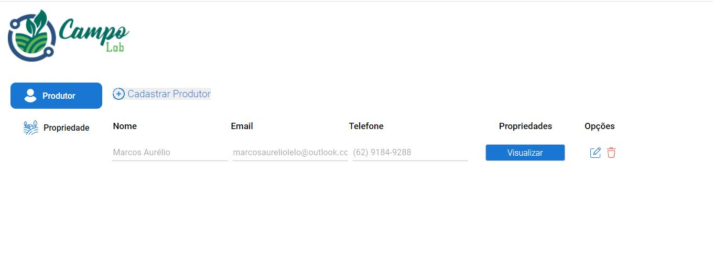
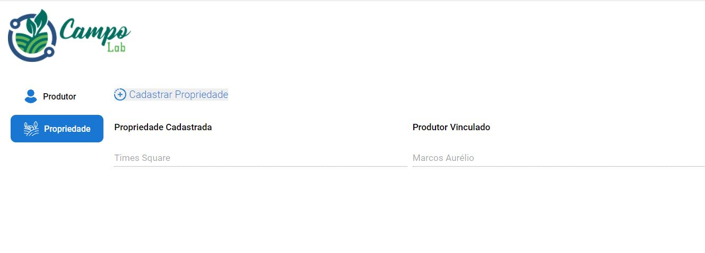

# Frontend da aplicação Campolab

Veja o protótipo do projeto [clicando aqui](https://www.figma.com/file/lvQMxXcVQ1ltIHPyOkgq2f/Campo-Lab?node-id=0%3A1).

## Como rodar minha aplicação ?

- É preciso estar com o [backend](https://github.com/Maark007/Campolab-Backend) configurado.

```
1 - Clone a aplicação
2 - yarn install ou npm install
3 - yarn start
```

### `Ferramentas utilizadas`

```
- React
- Styled Components
- Material UI
- SweetAlert
```

### `Preview`



